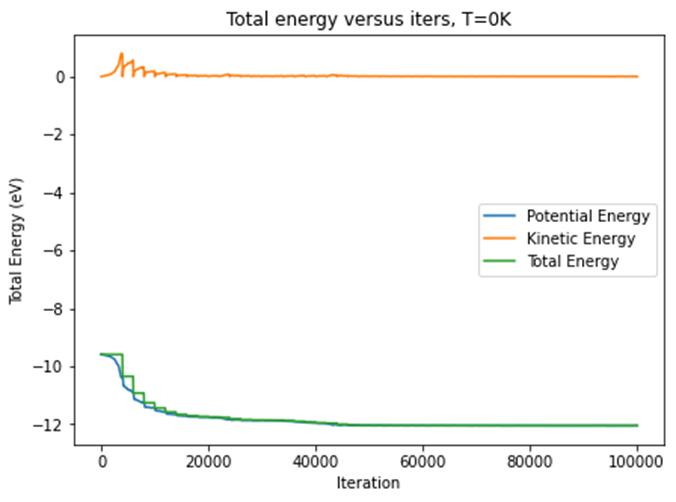

Let us from Molecular Statics to Molecular Dynamics

## Molecular Statics (MS) of 20×20 block

### Show initial block configuration

### State the boundary conditions

The block under consideration is a 2D finite, non-periodic boundary condition system with four free surfaces.

### Plot the relaxed structure

### Plot radial distribution function (RDF) of MS

For Molecular Statics simulations, the default temperature is set at T=0K.

### Plot the total energy and the hydrostatic pressure

|  |  |
| ------------------------------------------------------------ | ------------------------------------------------------------ |
|  |  |

To assess whether the Molecular Statics iterations have reached physiological convergence, we should examine the **Total (Potential) Energy**, **MaxForce**, and **Hydrostatic Pressure**.

# Molecular Dynamics (MD) beginning with a square 20×20 lattice

## 1. MD Simulation with positions & velocities at T=0K

### Verlet algorithm

In this study, we conduct a 2-D block Molecular Dynamics simulation using the Verlet Algorithm.

The formula is as :

### Start with zero velocities and zero kinetic energy.

*The general procedure for Molecular Dynamics relaxation is as follows:*

Initially, the rescale factor is set to 0.

Rescaling is performed using the factor to reset the kinetic energy (i.e., velocities) to zero and continue with the MD calculation.
This process is repeated until near equilibrium is achieved (with a temperature fluctuation tolerance of 1 Kelvin).

At this point, the relaxed structure is output.

#### Set relaxation parameters

T\_tolerance: rescale threshold, 1.0 Kelvin

kappa\_tolerence: stop iteration condition, kappa-1, 5e-4

delta\_t: timestep, 5e-15

Initial random displacement: ±5e-3 angstrom

#### Run MD at desire temperature of 0K

### Check the value of the total pressure and if it is not zero, scale coordinates appropriately and repeat the MD simulation. 

#### Total Potential & Kinetic Energy

#### RDF

#### Temperature

#### Total Hydrostatic Pressure versus Iterations

#### HS distribution on each atom

## 2. MD simulation at higher Temperatures

### 2.1 Set T = 5K. Assign to the particles’ velocities via scaling 

The velocity would be rescaled according to rescale factor κ.

#### Run MD at desire temperature of 5K

When iteration=52000 it reaches the kappa threshold, and the loop was stopped.

#### Total Potential & Kinetic Energy

#### RDF

#### Temperature

#### Total Hydrostatic Pressure versus Iterations

#### HS distribution on each atom

### 2.2&3. Molecular Dynamics at Various Desired Temperature

#### Using scaling of velocities, in steps of about 5K, up to about 85 K.

The target temperatures are set at 10, 15, 20, 25, 30, 35, 40, 45, 50, 55, 60, 65, 70, 75, 80, 85, 90, and 100 Kelvin, respectively.

The temperature tolerance is 1.5 Kelvin, at which point rescaling is automatically performed.

The kappa tolerance is set at 5e-4, below which the iteration process is terminated.

#### a. Analyze by display of atomic positions and RDF 

#### *Final* Atomic Positions at different *Constant Temperature*

Note that the **axes scale** of the plot **varies** with temperature increasing.

#### RDF

Again, the **axes scale** of the plot **varies** with temperature increasing.

#### State and explain if it is crystalline, liquid or gas and explain

0K, 2.5K, 5K, 10K, 15K, 20K, 25K:
Crystalline solid. Atoms are aligned, and the overall block volume is relatively low. The atom distribution observed in the RDF is quite concentrated. As the temperature increases, the RDF becomes less sharp.

30K, 35K, 40K:
The main body of the block remains a solid cluster. However, a few atoms have moved away, possibly indicating the formation of a small amount of liquid.

45K, 50K:
This phase appears to be liquid. Atoms are nearly fully and randomly dispersed far from their initial positions, spanning approximately ±2000 angstroms in both the x and y directions.

55K & 65K:
Both gas and liquid phases may be present. Most atoms are within ±1500 angstroms, but a few have reached 3000 or farther.

60K:
The structure in this plot may not be fully relaxed, so it is treated as an outlier and should be disregarded.

70K, 75K or above:
The structure should be gaseous. These plots indicate that within a range of ±2000 angstroms, atoms appear to be uniformly distributed. However, at certain temperatures, the structures may not be fully relaxed due to the termination conditions of the loop and the randomness of the optimization function across timesteps.

#### Temperature

#### Total Potential & Kinetic Energy

#### Total Hydrostatic Pressure versus Iterations

#### Hydrostatic Pressure of Atoms

We could find that with the increasing of the temperature, the atoms scatter away further. Furthermore, at lower temperatures, potential energy dominates the total internal energy, while when T gets higher the kinetics contributes increasingly more on total energy.

#### b. Evaluate total energy and hydrostatic pressures

#### Temperature dependencies

It seems that in general, total energy increases with initial temperature rising.

The point at 65K is probably an outlier.

## 3. Relevant specific heat

#### *Determine the temperature dependence of the relevant specific heat*

To determine the melting point or boiling point (phase transformation temperature), we can not only refer the block structure and RDF changing but also the heat capacity of constant volume (Relevant Special Heat). In this diagram we could recognize that peaks appear at 40-50 kelvin and 50-60 kelvin. So, we can predict that the phase transition happens in certain temperatures.

The other peaks may be because of the insufficient relaxation at previous (lower) temperature. We should avoid it for later simulations.

## 4. Autocorrelation Function (ACF)

#### *Determine the ACF of velocities for various temperatures*

##  5. Self-diffusion Coefficient

#### *Plot ln(D) vs 1/T for T up to 100 K and comment on the meaning of the slope.*

The *ln(D) - 1/T* diagram is as follows. However, the diffusion coefficient equation should be only applied for gas and liquid.

Thus, I plot the last few points of the equation, which is generally linear.

# *Bonus:* Molecular Dynamics (MD) beginning with larger initial lattices

##  MD Simulation of 25×25 block

#### Final Atomic Positions with Hydrostatic Stress on each atom at different 

#### Constant Temperature

#### RDF

#### Total Hydrostatic

#### Temperature dependencies

Obviously, total energy increases with initial temperature rising. The ascending trace seems linear.

#### Relevant specific heat

No Peak appears. I think that is because that I collected too less temperatures. Thus the sudden-change points cannot be shown.

#### Autocorrelation Function (ACF)

####  Self-diffusion Coefficient

The diffusion coefficient equation should be only applied for gas and liquid. The diagram discarded the first 2 points, showing generally linear.

## MD Simulation of 30×30 block

#### Final Atomic Positions with Hydrostatic Stress on each atom at different 

#### Constant Temperature

#### RDF

#### Total Hydrostatic

#### Temperature dependencies

Obviously, total energy increases with initial temperature rising. The ascending trace seems linear.

#### Relevant specific heat

No Peak appears. I think that is because that I collected too less temperatures. Thus the sudden-change points cannot be shown.

#### Autocorrelation Function (ACF)

#### Self-diffusion Coefficient

The diffusion coefficient equation should be only applied for gas and liquid. The diagram discarded the first 2 points, showing generally linear.

## MD Simulation of 40×40 block

I do not have time. I am so sorry that I do not know well any other technique to let it running faster…

I have to wait for 150 minutes at one single temperature for 40×40 block. And I do not think less iteration number + high timestep would give reliable result…

## Summary of comparison among different block size

In short, MD calculations show similar trend of variation on relaxed block, radial distribution function, internal energies, the ACF diagram style, and Diffusion Coefficient.

Thus, I think the predicted melting point of smaller and larger blocks should be same.

Unfortunately, I did not got enough datapoints on temperatures around melting point… Thus no self-proof can be provided…

## Data availability

All the data results of MD simulations mentioned above is available at:

https://drive.google.com/drive/folders/1R5w2TStoL7ZlCxs0jjQ5mZlM1herWHws?usp=sharing, https://drive.google.com/drive/folders/1eZNfUZ\_3Q4hnfJyVnNrTjLfQXL\_WNSSV?usp=sharing

To reconstruct the model, one could follow the Jupyter Notebook (.ipynb file) load and re-plot.

## Short Discussion

#### The sequential-parallel dilemma has partly been solved

In Homework 3, I mentioned that although the *for-loop* is easy to understand and implement, it does not naturally occur as a process in the real world. To update the parameters of atoms, a more accurate and effective approach is to allow simultaneous updates across all atoms.

After discussing this with the TA, I revised several functions in Homework 4 to update some parameters using tensors. This is not difficult to grasp for anyone already familiar with Linear Algebra. We no longer need to separate relative positions into Δr_x, Δr_y scalars; instead, we can convert them into a (400,400,2) tensor!

An unexpected benefit is that, since we only need a single tensor addition instead of 400\*2=800 evaluations/assignments, the main loop's speed has increased dramatically. (In fact, a similar concept was taught in MSE576 when using PyTorch. At that time, I focused mainly on the credits and followed the demo to determine which axis was related to another line, but I didn't delve into the subject.)

#### Numba jit Precautions

In addition to the key points mentioned in Zesheng's recitation (avoiding global variables, converting lists to nd.arrays, placing iteration variables in indices), I discovered several aspects that require further attention:

1.  Minimize equation operations through packages (np.sum, math.sqrt, np.power, etc.) and try using native Python operations (+, -, *, /, **, %, etc.).

2.  Reduce the use of local intermediate variables in functions. Although this doesn't result in syntax errors or warnings, it negatively impacts runtime speed.

3.  It is preferable to break large functions into smaller ones and apply the @jit decorator to each.

4.  This approach works well with for-loops but offers less benefit when creating variables, arrays, or other elements.

#### For-loops versus tensor operations

I should note that tensor operations do not universally accelerate iterations. 

For the main loop's updating function, vectorization significantly increases iteration speed. 

However, for optimization functions, the outcome depends on the system size. From my observations, for-loops and split functions under @jit work better for smaller systems (10\*10, 15\*15), while batch parallelized updating (tensor operations) is faster for larger systems (20\*20 and above). We must carefully consider our function definitions to ensure relatively high relaxation efficiency.

#### Temperature chosen

The 20\*20 results show that having too many data points at high temperatures is redundant, as they lead to similar outcomes as previous ones. 

However, in the 25\*25 and 30\*30 results, it appears that too few temperatures were selected between 40-60K, making it difficult to identify peaks that indicate phase transitions.

I suggest that we could implement an automatic relaxation code using the *least square method*. For example, we could start with 0K, then 100K, followed by 50K, 25K, and so on, until we locate one or more peaks in heat capacity.
